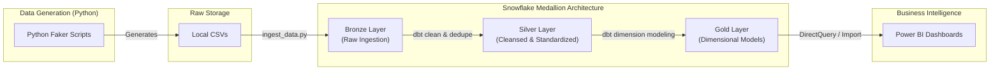
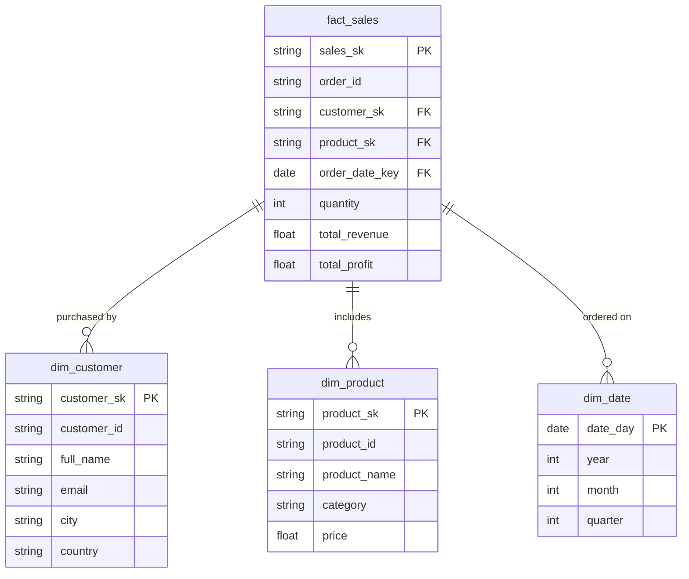

# Enterprise Medallion Data Warehouse on Snowflake using dbt

Welcome to the Enterprise Medallion Data Warehouse project. This repository demonstrates a production-grade analytics engineering workflow, utilizing a modern data stack centered around Python, Snowflake, dbt Core, Power BI, and GitHub Actions.

## 🚀 Business Problem & Overview

A global e-commerce enterprise receives operational data from multiple disparate systems: Customers, Orders, Products, Payments, Inventory, Shipping, Returns, and Marketing.

The primary challenge is that this operational data is messy. It contains missing values, duplicates, bad foreign keys, and inconsistent formats. The analytics and BI teams require a clean, reliable, and integrated source of truth for reporting and executive dashboards.

**Objective:** Build an end-to-end ELT pipeline and Data Warehouse using the Medallion Architecture (Bronze, Silver, Gold) to provide validated, standardized, and modeled data for downstream BI tools like Power BI.

## 🛠️ Technology Stack

- **Data Generation & Extraction:** Python (Faker, Pandas)
- **Data Loading:** Snowflake (Internal Stages, `COPY INTO`)
- **Data Warehouse Engine:** Snowflake
- **Data Transformation (ELT):** dbt Core
- **Data Quality & Testing:** dbt tests (schema validations, unique, not null, relationships)
- **CI/CD:** GitHub Actions
- **Business Intelligence:** Power BI (Concepts / Dashboards structure)

## 🏗️ Architecture

The pipeline follows the Medallion architecture paradigm to progressively clean and model the data.



### The Medallion Layers
1. **Bronze (Raw Data):** Data is loaded into Snowflake exactly as it is received from the source. It preserves all anomalies (duplicates, nulls, bad keys). Metadata columns (`_load_timestamp`, `_source_file`) are added.
2. **Silver (Cleansed Data):** dbt transforms the bronze data by deduplicating rows, handling nulls, standardizing formats (e.g., currency, status, dates), and casting data types correctly.
3. **Gold (Business Level Data):** dbt models the silver data into a Star Schema. Surrogate keys are generated using `dbt_utils`. Fact and Dimension tables are created to answer specific business questions.

## 📊 Star Schema (Gold Layer)



*(Note: Additional facts like `fact_returns`, `fact_payments`, `fact_inventory` and dimensions like `dim_shipping`, `dim_campaign`, `dim_geography` exist in the gold layer).*

## 📁 Repository Structure

```
medallion-data-warehouse/
│
├── data/raw/                  # Ignored in git, generated mock data
├── scripts/
│   ├── generate_data_*.py     # Python scripts for synthetic data generation
│   └── ingest_data.py         # Python script to load data into Snowflake
├── snowflake/
│   └── setup.sql              # Snowflake role, warehouse, db, and schema definitions
├── dbt_project/
│   ├── dbt_project.yml
│   ├── profiles.yml
│   ├── packages.yml
│   ├── macros/                # Custom Jinja macros
│   └── models/
│       ├── bronze/            # Raw views and sources.yml
│       ├── silver/            # Cleansing models
│       └── gold/              # Fact & Dimension models
├── docs/                      # General project documentation
├── images/                    # Screenshots and diagrams
├── powerbi/                   # Power BI templates (placeholders)
└── .github/workflows/         # CI/CD pipeline definition
```

## ⚙️ How to Run the Project

1. **Setup Python Environment:**
   ```bash
   pip install -r requirements.txt
   ```
2. **Generate Synthetic Data:**
   Run the scripts in the `scripts/` folder to generate realistic data into `data/raw/`.
   ```bash
   python scripts/generate_data_cp.py
   python scripts/generate_data_op.py
   # etc...
   ```
3. **Setup Snowflake:**
   Execute `snowflake/setup.sql` in your Snowflake environment using an `ACCOUNTADMIN` role.
4. **Ingest Data:**
   Create a `.env` file in the root with your Snowflake credentials (e.g., `SNOWFLAKE_USER`, `SNOWFLAKE_PASSWORD`, `SNOWFLAKE_ACCOUNT`).
   Run the ingestion script:
   ```bash
   python scripts/ingest_data.py
   ```
5. **Run dbt Models:**
   Navigate to the `dbt_project` directory and configure your `profiles.yml` (using env vars from `.env`).
   ```bash
   cd dbt_project
   dbt deps
   dbt build
   ```

## ✅ Data Quality & Testing

This project incorporates robust data quality checks using dbt tests.
Over 25 tests are configured in `dbt_project/models/schema.yml`, validating:
- Primary Key Uniqueness and Non-Nullability (`unique`, `not_null`)
- Accepted Values (e.g., Order Status must be 'pending', 'shipped', 'delivered', or 'cancelled')
- Foreign Key Relationships (e.g., ensuring a `customer_sk` in `fact_sales` exists in `dim_customer`)

## 🔄 CI/CD Pipeline

The `.github/workflows/ci_cd.yml` file automates the testing and deployment.
On every push or pull request to `main`:
1. Checks out code and sets up Python.
2. Installs `dbt-snowflake`.
3. Runs `dbt deps`, `dbt compile`, and `dbt build` (runs models and tests).
4. Generates dbt documentation and deploys it to GitHub Pages.

## 📈 Power BI Dashboards (Concepts)

In a production setting, connect Power BI to the `gold` schema in Snowflake.
Key Dashboards enabled by this architecture:
- **Executive Sales Dashboard:** Revenue, Profit, Year-over-Year Growth (Fact Sales + Dim Date).
- **Customer Dashboard:** Repeat customers, Customer Lifetime Value (Fact Sales + Dim Customer).
- **Inventory Dashboard:** Stock levels by warehouse, turnover (Fact Inventory + Dim Product).

## 🔮 Future Improvements

- Switch Python Ingestion to an orchestrator like Airflow or Dagster.
- Use Snowpipe for continuous data loading instead of batch `COPY INTO`.
- Implement Slowly Changing Dimensions (SCD Type 2) in dbt for Customer Address changes.
- Add dbt freshness tests for sources.
